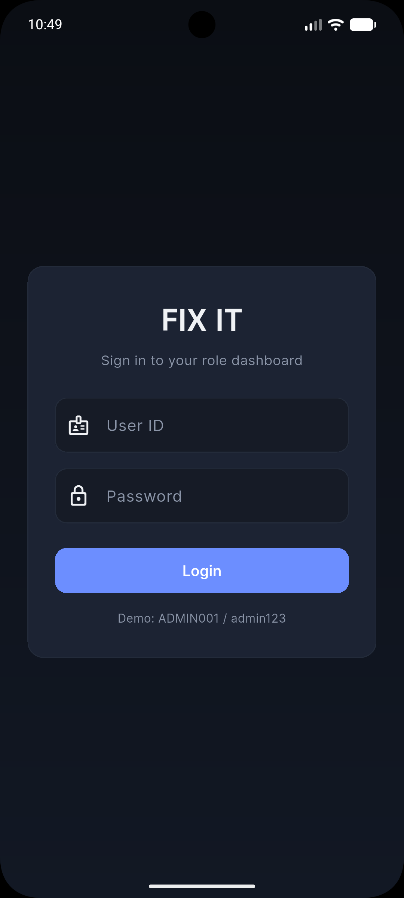
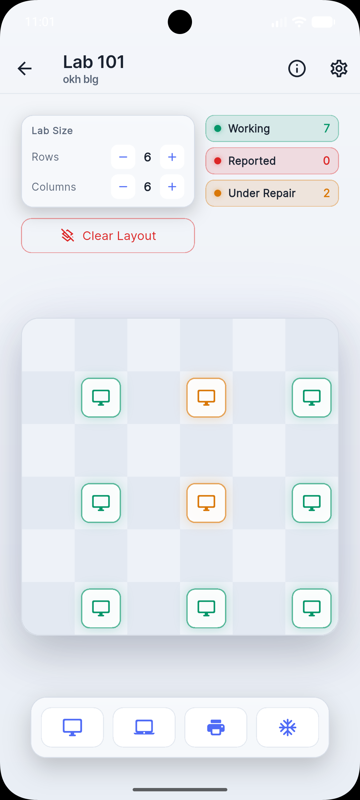
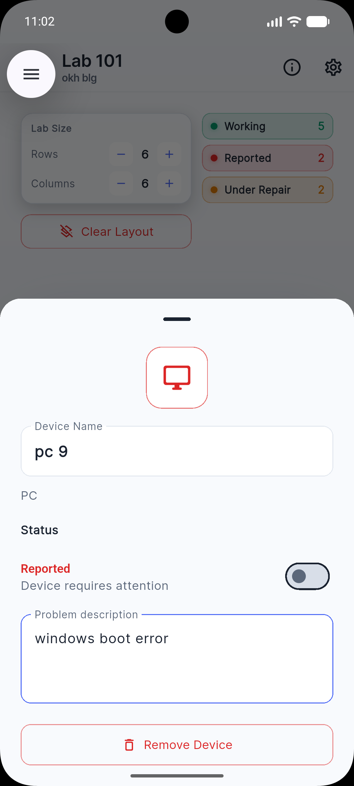
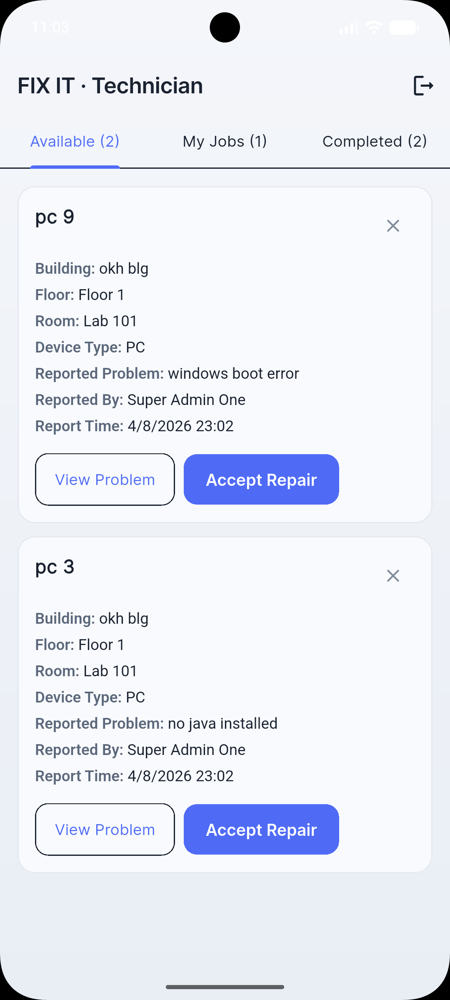
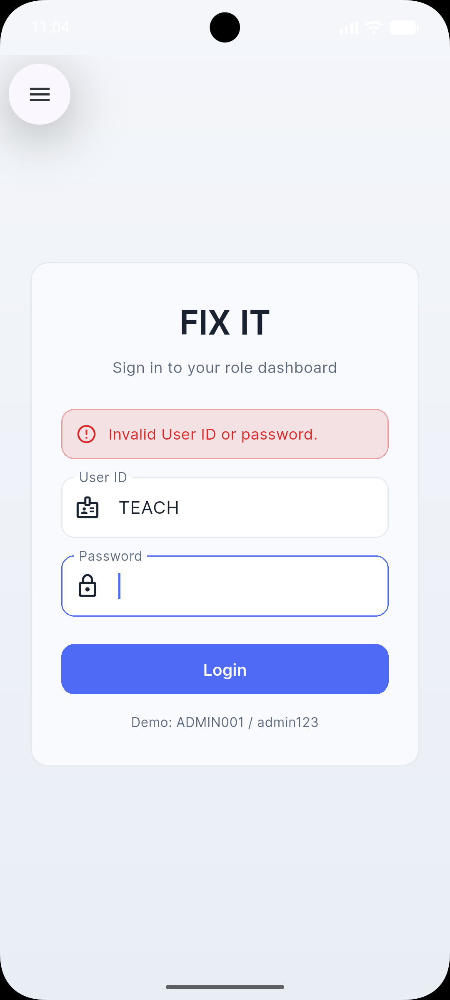
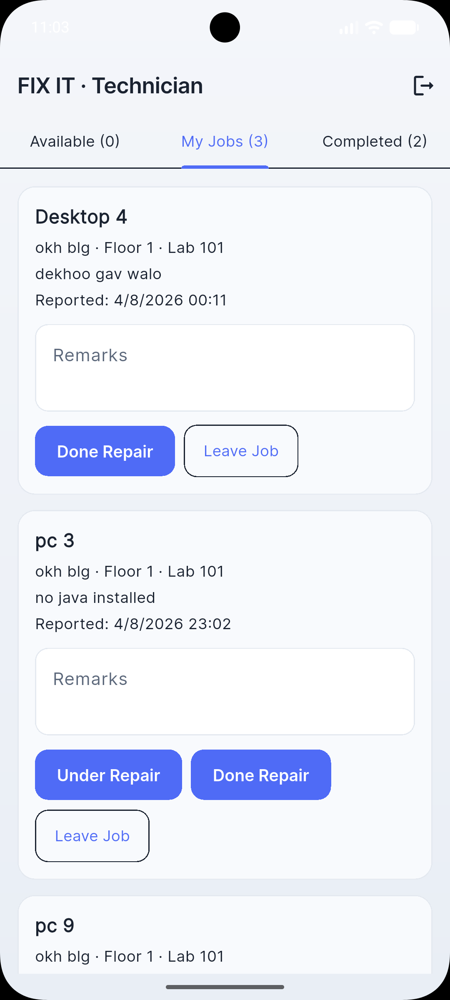
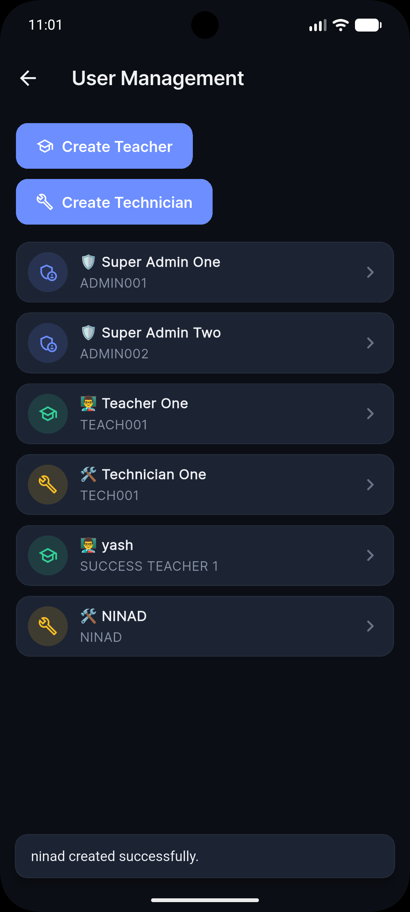
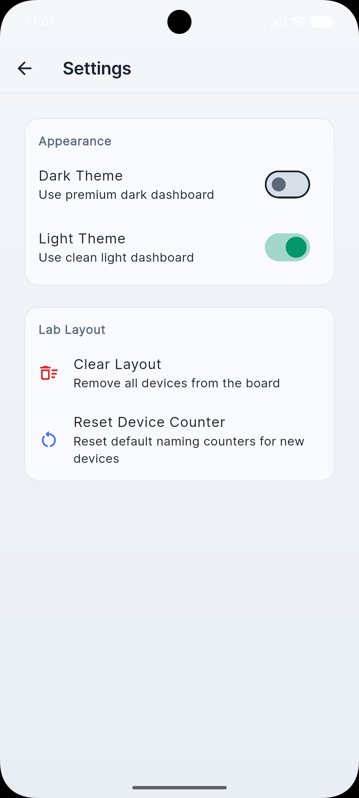
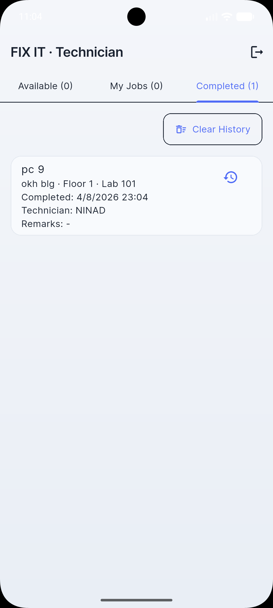

# 🛠️ FIX IT – Smart Lab Maintenance & Asset Management System

> **"Fix it before it breaks."**

FIX IT is a Flutter-based smart laboratory management system designed to help educational institutions efficiently manage computer labs, report faulty devices, assign technicians, and track repair history.

This project is being developed as a real-world college management solution with separate interfaces for **Super Admin**, **Teachers**, and **Technicians**.

---

# 🚀 Version 2 Highlights

Version 2 introduces a complete maintenance workflow with role-based access and technician task management.

## ✨ New Features

### 👑 Super Admin
- Manage Buildings, Floors and Labs
- Interactive drag-and-drop lab layout editor
- Rename/Delete devices
- Device status management
- Report faulty devices
- Repair history viewer
- User Management
- Theme switching (Light/Dark)

---

### 👨‍🏫 Teacher
- View assigned labs
- Report faulty devices
- Live device status
- View repair progress
- View technician details while repair is in progress

---

### 🔧 Technician
- Available Jobs
- Accept Repair Tickets
- My Jobs section
- Mark Device Under Repair
- Add Repair Remarks
- Complete Repair
- Leave Assigned Job
- Completed Repair History

---

## 🖥️ Interactive Lab Editor

- Drag & Drop Devices
- Chessboard Layout
- Zoom Support
- Device Renaming
- Device Status Colors
- Persistent Layout Storage

---

# 🎨 Device Status

🟢 Working

🔴 Reported

🟡 Under Repair

Status updates are synchronized between all user roles.

---

# 🏢 Building Structure

```
Building
 ├── Floor
 │     ├── Lab
 │     │      ├── Devices
```

Supports multiple:

- Buildings
- Floors
- Labs
- Device Types

---

# 👥 Role Based Access

| Role | Permissions |
|-------|-------------|
| Super Admin | Full Control |
| Teacher | Report Problems & Monitor Repairs |
| Technician | Accept & Complete Repairs |

---

# ⚙️ Built With

- Flutter
- Dart
- Material 3
- SharedPreferences
- Provider / ChangeNotifier Architecture

---

# 📱 Current Features

✅ Multi Building Support

✅ Multi Floor Support

✅ Multi Lab Support

✅ Persistent Storage

✅ Drag & Drop Layout

✅ Zoomable Chessboard

✅ Device History

✅ Repair Ticket System

✅ Technician Workflow

✅ Dark Theme

✅ Light Theme

✅ Role Based Login

✅ User Management

---

# 🛣️ Roadmap

## Upcoming

- QR Code Device Identification
- Firebase Cloud Database
- Push Notifications
- Health Score for Devices
- Technician Analytics
- Search & Filters
- Dashboard Statistics
- Export Reports (PDF/Excel)
- Image Attachments
- Live Synchronization
- Campus-wide Notifications

---
## 📸 Application Screenshots

| Login Screen | Lab Layout |
|--------------|------------|
|  |  |

| Report Problem | Technician Dashboard |
|----------------|----------------------|
|  |  |

| Invalid ID/Password | Accepted Jobs |
|----------------------|---------------|
|  |  |

| Creating IDs | Theme Change |
|---------------|--------------|
|  |  |

| Completed Jobs |
|----------------|
|  |
---

# 📂 Project Structure

```
lib/
│
├── controllers/
├── models/
├── presentation/
├── services/
├── widgets/
├── theme/
├── utils/
└── screens/
```

---

# 🎯 Project Vision

FIX IT aims to eliminate manual maintenance registers by providing a digital, transparent, and real-time maintenance management platform for educational institutions.

---

# 👨‍💻 Developer

**Atharv Bhagade**

Computer Science Engineering Student

📧 Email:
atharv.bhagade.15@gmail.com

GitHub:
https://github.com/atharv-bhagade

---

# ⭐ Version

Current Release

**Version 2.0**

---

Made with ❤️ using Flutter.
